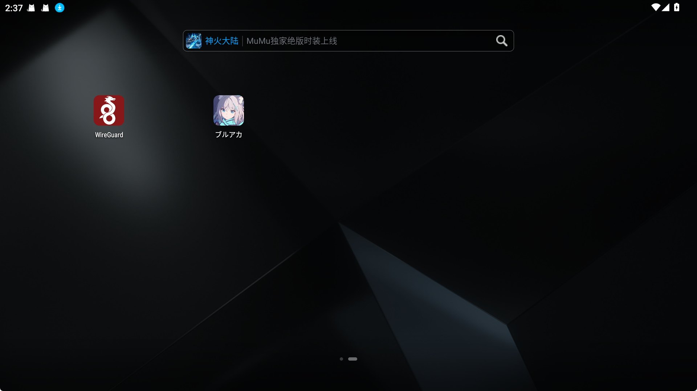
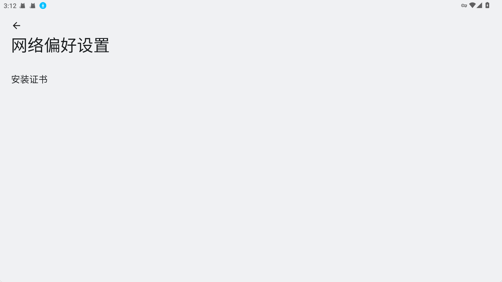

# GameServer.SCHALE

## 安装环境

- 一点计算机基础
- [.NET SDK 8.0](https://dotnet.microsoft.com/zh-cn/download/dotnet/8.0)
- [mitmproxy](https://downloads.mitmproxy.org/11.0.0/mitmproxy-11.0.0-windows-x86_64-installer.exe)
- [WireGuard](https://download.wireguard.com/android-client/com.wireguard.android-1.0.20231018.apk)
- [SQL Express](https://www.microsoft.com/zh-tw/sql-server/sql-server-downloads)
- [SQL Server Management Studio (SSMS)](https://learn.microsoft.com/zh-tw/sql/ssms/download-sql-server-management-studio-ssms?view=sql-server-ver16)
- [MuMu Player 12](https://adl.easebar.com/d/g/mumu/c/mumuglobal?type=pc&direct=1)

## 前置工作

- ### 把WireGuard拖到MuMu Player里安装



- ### 使用mitmproxy挂钩MuMu Player 12

  设置服务器地址和端口 `redirect_server.py`

  运行mitmproxy:

  ```
  mitmweb -m wireguard --no-http2 -s redirect_server.py --set termlog_verbosity=warn --ignore 127.0.0.1
  ```


- ### 配置WireGuard

  

  扫描你mitmproxy二维码添加配置

  

  

  启动WireGuard后安装证书

  

  

## 启动服务

1. 启动SQL server
2. 启动私人游戏服务器
3. 启动[start.cmd](./Scripts/redirect_server_mitmproxy/start.cmd)
4. 启动MuMu Player
5. 启动WireGuard
6. Start游戏
7. 享受 :smile:

> [!NOTE]  
> 它还可以作为数据包转储器使用。你可以保存流文件以便后续处理

> [!WARNING]  
> 如果在您的网络上启用了 IPv6，则重定向可能无法正常工作
>
> 可以通过更改 WireGuard 设置在 Android 端禁用 IPv6 来避免此问题

### 步骤:

1. 将接口地址更改为 `fd00::1/128`

   将 DNS 地址字段留空

2. 创建一个虚拟的 peer，允许的 IP 地址设置为 `2000::/3`，位于 mitmproxy peer 之间，可以使用任何公钥

3. 将 mitmproxy peers 添加在最后